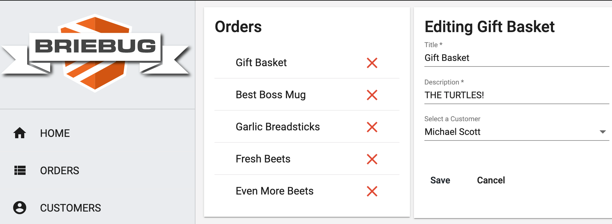

# Customer/Order Dashboard

This project was generated using [Nx](https://nx.dev).



## App Description

This is the 3rd of 8 Accelerated Angular LevelUp Applications.
It aims to show a more complex feature set/data model for a fully reactive, well architected Angular application.

Specifically, this dashboard app features CRUD functionality on two entities - Customers...

```json
  "customers": [
    {
      "id": "56789f40-b0fb-4aa6-8e88-376b4edfm8he",
      "title": "Shopping",
      "description": ":)",
      "firstName": "Michael",
      "lastName": "Scott",
      "email": "tobyhater@yahoo.com",
      "orders": [
        {
          "id": "56789f40-b0fb-4aa6-4e88-376b4edfm8he",
          "title": "Gift Basket",
          "description": "THE TURTLES!",
          "customerId": "56789f40-b0fb-4aa6-8e88-376b4edfm8he"
        },
      ]
    },
```

and Orders...

```json
"orders": [
    {
      "id": "56789f40-b0fb-4aa6-4e88-376b4edfm8he",
      "title": "Gift Basket",
      "description": "THE TURTLES!",
      "customerId": "56789f40-b0fb-4aa6-8e88-376b4edfm8he"
    },
```

and assign orders to any customer you like.
The home page shows all customers with their assigned orders.

## Getting Started

Run `npm install`.

## Development server

Run `npm run serve:all` for a dev server and to run the json-server api. Navigate to http://localhost:4200/. The app will automatically reload if you change any of the source files.

## Build

Run `ng build dashboard` to build the project. The build artifacts will be stored in the `dist/` directory. Use the `--prod` flag for a production build.

## Understand your workspace

Run `nx dep-graph` to see a diagram of the dependencies of your projects.
